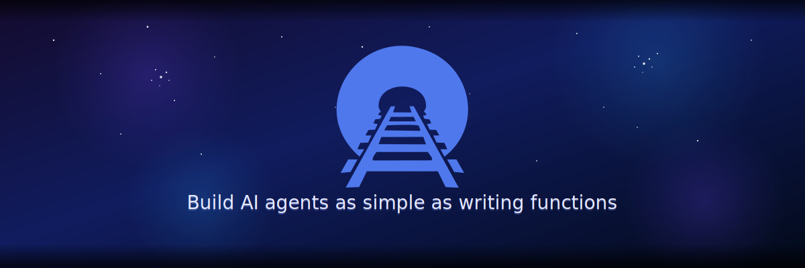

# Railtracks

<p align="center">
  
</p>

<!-- Tip bar -->
<div align="center">
  <div style="display:inline-block; padding: 10px 18px; border-radius: 999px; background: linear-gradient(90deg, #4f78ec, #6d7cff, #00C2FF); color: #ffffff; font-weight: 600;">
    Build AI agents in minutes • Zero config • Local visualization • Pure Python
  </div>
</div>

<br>

<p align="center">
  <a href="#-quick-start">
    
  </a>
  <a href="https://railtownai.github.io/railtracks/">
    
  </a>
  <a href="https://github.com/RailtownAI/railtracks/tree/main/examples">
    
  </a>
  <a href="https://discord.gg/h5ZcahDc">
    
  </a>
</p>

<p align="center">
  <a href="https://pypi.org/project/railtracks/">
    
  </a>
  <a href="https://pypi.org/project/railtracks/">
    
  </a>
  <a href="https://pypistats.org/packages/railtracks">
    
  </a>
  <a href="https://opensource.org/licenses/MIT">
    
  </a>
  <a href="https://github.com/RailtownAI/railtracks/stargazers">
    
  </a>
</p>

---

## ✨ What is Railtracks?

**Railtracks** transforms how you build AI agents. While other frameworks force you into rigid workflows or complex APIs, Railtracks lets you create intelligent agents using simple Python functions and natural control flow.

```python
import railtracks as rt

# Define a tool (just a function!)
def get_weather(location: str) -> str:
    return f"It's sunny in {location}!"

# Create an agent with tools
agent = rt.agent_node(
    "Weather Assistant",
    tool_nodes={rt.function_node(get_weather)},
    llm_model=rt.llm.OpenAILLM("gpt-4o"),
    system_message="You help users with weather information."
)

# Run it
result = rt.call_sync(agent, "What's the weather in Paris?")
print(result.text)  # "Based on the current data, it's sunny in Paris!"
```

**That's it.** No complex configurations, no learning proprietary syntax. Just Python.

---

## 🎯 Why Choose Railtracks?

<table>
<tr>
<td width="50%">

### 🐍 **Pure Python Experience**
- Write agents like regular Python functions
- No YAML, no DSLs, no magic strings
- Use your existing debugging tools and IDE features

### 🔧 **Tool-First Architecture**
- Any Python function becomes a tool instantly
- Seamless integration with APIs, databases, files
- Built-in support for MCP (Model Context Protocol)

</td>
<td width="50%">

### ⚡ **Automatic Intelligence**
- Smart parallelization without async/await complexity
- Built-in error handling and retries
- Automatic tool discovery and validation

### 👁️ **Transparent by Design**
- Real-time visualization of agent execution
- Complete execution history and logging
- Debug agents like you debug regular code

</td>
</tr>
</table>

---

## 🚀 Quick Start

### Installation
```bash
pip install railtracks railtracks-cli
```

### Your First Agent in 30 Seconds

```python
import railtracks as rt

# 1. Create tools (just functions with decorators!)
@rt.function_node
def count_characters(text: str, character: str) -> int:
    """Count occurrences of a character in text."""
    return text.count(character)

@rt.function_node
def word_count(text: str) -> int:
    """Count words in text."""
    return len(text.split())

# 2. Build an agent with tools
text_analyzer = rt.agent_node(
    "Text Analyzer",
    tool_nodes={count_characters, word_count},
    llm_model=rt.llm.OpenAILLM("gpt-4o"),
    system_message="You analyze text using the available tools."
)

# 3. Use it to solve the classic "How many r's in strawberry?" problem
@rt.session
async def main():
    result = await rt.call(text_analyzer, "How many 'r's are in 'strawberry'?")
    print(result.text)  # "There are 3 'r's in 'strawberry'!"

# Run it
import asyncio
asyncio.run(main())
```

### Visualize Your Agent
```bash
railtracks init  # Setup visualization (one-time)
railtracks viz   # See your agent in action
```

<p align="center">
  
</p>

---

## 💡 Real-World Examples

### 📊 Multi-Agent Research System
```python
# Research coordinator that uses specialized agents
researcher = rt.agent_node("Researcher", tool_nodes={web_search, summarize})
analyst = rt.agent_node("Analyst", tool_nodes={analyze_data, create_charts})
writer = rt.agent_node("Writer", tool_nodes={draft_report, format_document})

coordinator = rt.agent_node(
    "Research Coordinator",
    tool_nodes={researcher, analyst, writer},  # Agents as tools!
    system_message="Coordinate research tasks between specialists."
)
```

### 🔄 Complex Workflows Made Simple
```python
# Customer service system with context sharing
def handle_customer_request(query: str):
    with rt.Session() as session:
        # Technical support first
        technical_result = await rt.call(technical_agent, query)
        
        # Share context with billing if needed
        if "billing" in technical_result.text.lower():
            session.context["technical_notes"] = technical_result.text
            billing_result = await rt.call(billing_agent, query)
            return billing_result
        
        return technical_result
```

---

## 🌟 What Makes Railtracks Special?

**Railtracks** is a lightweight agentic LLM framework for building modular, multi-LLM workflows. Unlike other frameworks like **LangGraph** and **Google ADK**, Railtracks focuses on simplicity and developer experience.

| Feature | Railtracks | LangGraph | Google ADK |
|---------|------------|-----------|------------|
| **Python-first, no DSL** | ✅ Yes | ❌ No | ✅ Yes |
| **Built-in visualization** | ✅ Yes | ✅ Yes | ⚠️ Limited |
| **Zero setup overhead** | ✅ Yes | ✅ Yes | ❌ No |
| **LLM-agnostic** | ✅ Yes | ✅ Yes | ✅ Yes |
| **Pure Python functions** | ✅ Yes | ❌ Complex graphs | ⚠️ Mixed |
| **Automatic optimization** | ✅ Yes | ⚠️ Manual | ⚠️ Manual |

---

## 🛠️ Powerful Features

### **🔗 Universal LLM Support**
Works with OpenAI, Anthropic, Google, local models, and more:
```python
# Switch providers effortlessly
openai_agent = rt.agent_node("Assistant", llm_model=rt.llm.OpenAILLM("gpt-4o"))
claude_agent = rt.agent_node("Assistant", llm_model=rt.llm.AnthropicLLM("claude-3-5-sonnet"))
local_agent = rt.agent_node("Assistant", llm_model=rt.llm.OllamaLLM("llama3"))
```

### **📦 Rich Tool Ecosystem** 
- **Functions**: Any Python function becomes a tool
- **MCP Integration**: Use Model Context Protocol tools
- **Agent Tools**: Use agents as tools in other agents
- **Structured Outputs**: Type-safe responses with Pydantic

### **🔍 Built-in Observability**
- Real-time execution graphs
- Performance metrics
- Error tracking and debugging
- Local visualization (no signup required!)

---

## 📚 Learn More

| Resource | Description |
|----------|-------------|
| [📖 **Documentation**](https://railtownai.github.io/railtracks/) | Complete guides and API reference |
| [🎯 **Quickstart Tutorial**](https://railtownai.github.io/railtracks/quickstart/quickstart/) | Get up and running in 5 minutes |
| [💼 **Example Gallery**](https://github.com/RailtownAI/railtracks/tree/main/examples) | Real-world agent implementations |
| [💬 **Discord Community**](https://discord.gg/h5ZcahDc) | Get help and share your creations |
| [🤝 **Contributing Guide**](./CONTRIBUTING.md) | Help make Railtracks better |

---

## 🚀 Ready to Build?

```bash
pip install railtracks railtracks-cli
```

<div align="center">
  <div style="display:inline-block; padding: 10px 16px; border-radius: 10px; background: rgba(79,120,236,0.08); border: 1px solid rgba(79,120,236,0.35); color: #2f3b66; font-weight: 600;">
    ✨ Join thousands of developers building the future with AI agents
  </div>
</div>

<br>

<div align="center">
  <a href="https://github.com/RailtownAI/railtracks/stargazers">
    
  </a>
</div>

<br>

<p align="center">
  <strong>From simple chatbots to complex multi-agent systems—Railtracks scales with your ambitions.</strong>
</p>