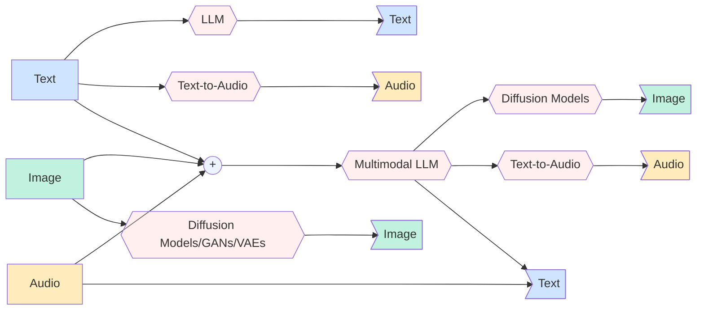

Traditionally, LLMs map text input to text output. Newer multimodal foundation models can accept additional modalities such as images and, in some cases, audio.

There are also many scenarios where you generate non‑text outputs from text prompts (images or speech) using diffusion models or Text-to-Speech (TTS) models. Below is an illustration of the input/output permutations across the three common modalities. This is by no means a comprehensive coverage on all of the different pathways possible but should serve to illustrate the overall pattern.



As you can imagine, covering all of these different paths while maintaining a relatively flexbile and developer friendly public API for any framework would be challening. Therefore, currently for the agents built using our framework we support **text**, **vision**, and **PDF documents** for input and **only text** as output. This won't prevent users from having an image generation model wrapped inside a **`Tool`** and giving the agent access to this.

If you would like to see other modalities supported on either input or output side of the equation, we'd welcome your contributions or discussions for such feature requests.

---
## Text
**Text** is the default modality supported in Railtracks. No special operations are needed and you can simply follow the rest of the docs.

---
## Image
Given the LLM powering your agent, you can pass image inputs to your multimodal agent. The only required step is to construct a `UserMessage` and pass in the parameter `attachment`

```python
rt.llm.UserMessage(
    content="What is in this image?",
    attachment=""
)
```
The `attachment` parameter can be a single `str` or a `list[str]`. We currently support the following:

- Both file and web URLs of the following types: `jpeg`, `png`, `gif`, and `webp`
- `byte64` encoded string of the image

---
## PDF documents
PDF input works through the same `attachment` parameter. The provider must natively support PDF input (currently OpenAI's `gpt-4o` / `gpt-5.x` family and Anthropic's Claude models via the `file` content block); other providers will reject the request.

```python
--8<-- "docs/scripts/multimodal.py:pdf_local"
```

Supported PDF sources:

- Local file paths ending in `.pdf`
- Base64-encoded PDF payloads or full `data:application/pdf;base64,...` URIs
- HTTPS URLs ending in `.pdf` — **only with `trust_urls=True`** (see below)

!!! warning "URL PDFs require `trust_urls=True`"
    Unlike image URLs (which the provider fetches), PDFs are passed to the provider inline as base64. That means railtracks downloads the URL **in-process** before the call. End-user-supplied URLs are an SSRF surface once their bytes are fetched on your server and embedded in the prompt, so this path is opt-in:

    ```python
    --8<-- "docs/scripts/multimodal.py:pdf_url"
    ```

    Set `trust_urls=True` only when every URL in `attachment` is developer-controlled (a hard-coded path, an internal doc, a trusted CDN). For user-supplied URLs, download the PDF out-of-band first and pass the local path or base64 payload instead.
