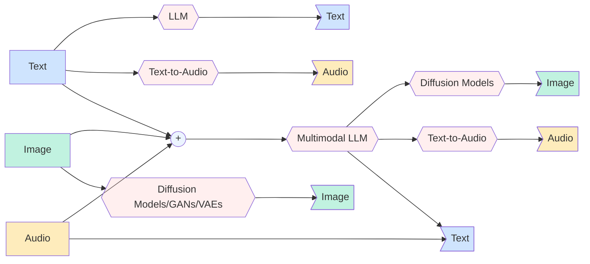

Traditionally, LLMs map text input to text output. Newer multimodal foundation models can accept additional modalities such as images and, in some cases, audio.

There are also many scenarios where you generate non‑text outputs from text prompts (images or speech) using diffusion models or Text-to-Speech (TTS) models. Below is an illustration of the input/output permutations across the three common modalities. This is by no means a comprehensive coverage on all of the different pathways possible but should serve to illustrate the overall pattern.


```mermaid
flowchart LR
    %% Inputs
    T_IN[Text]
    I_IN["Image"]
    A_IN["Audio"]
    ADD((+))

    %% Outputs
    T_OUT>"Text"]
    T_OUT2>"Text"]
    I_OUT>"Image"]
    I_OUT2>"Image"]
    A_OUT>"Audio"]
    A_OUT2>"Audio"]

    %% Paths / Models
    LLM{{"LLM"}}
    TTS{{"Text-to-Audio"}}
    TTS2{{"Text-to-Audio"}}
    MLLM{{"Multimodal LLM"}}
    DIFF{{"Diffusion Models"}}
    I2I{{"Diffusion Models/GANs/VAEs"}}

    %% Connections
    T_IN --> LLM --> T_OUT
    T_IN --> TTS --> A_OUT
    T_IN --> ADD
    I_IN --> ADD
    A_IN --> ADD
    A_IN --> T_OUT2
    ADD --> MLLM
    MLLM --> DIFF --> I_OUT
    MLLM --> TTS2 --> A_OUT2
    MLLM --> T_OUT2
    I_IN --> I2I --> I_OUT2

    %% === COLOR THEMING ===
    %% (Separate comments — not inline)

    classDef text fill:#60A5FA,fill-opacity:0.3
    classDef image fill:#34D399,fill-opacity:0.3
    classDef audio fill:#FBBF24,fill-opacity:0.3
    classDef model fill:#FECACA,fill-opacity:0.3
    classDef add fill:#BFDBFE,fill-opacity:0.3

    %% Apply consistent color classes
    class T_IN,T_OUT,T_OUT2 text;
    class I_IN,I_OUT,I_OUT2 image;
    class A_IN,A_OUT,A_OUT2 audio;
    class ADD add;
    class LLM,VLM,T2I,TTS,TTS2,A2T,MLLM_TI,MLLM_TA,MLLM,DIFF,I2I model;

```

As you can imagine, covering all of these different paths while maintaining a relatively flexbile and developer friendly public API for any framework would be challening. Therefore, currently for the agents built using our framework we support **text**, **vision**, and **PDF documents** for input and **only text** as output. This won't prevent users from having an image generation model wrapped inside a **`Tool`** and giving the agent access to this.

If you would like to see other modalities supported on either input or output side of the equation, we'd welcome your contributions or discussions for such feature requests.

---
## Text
**Text** is the default modality supported in Railtracks. No special operations are needed and you can simply follow the rest of the docs.

---
## Image
Given the LLM powering your agent, you can pass image inputs to your multimodal agent. The only required step is to construct a `UserMessage` and pass in the parameter `attachment`

```python
--8<-- "docs/scripts/multimodal.py:public_url"
```
The `attachment` parameter takes a file path, URL, base64 string or data URI, an [`Attachment`](#the-attachment-object), or a list of them. We currently support the following:

- Both file and web URLs of images, such as `jpeg`, `png`, `gif`, `webp` and `avif`. Most providers accept only the first four: OpenAI, Anthropic and Gemini reject `avif`, but some OpenAI-compatible servers accept it.
- A base64 string or data URI of the image

A local file's type is read from its first bytes, then from its extension, so a JPEG saved as `.png` is still sent as `image/jpeg`. A web URL without a file extension (for example a CDN link) is passed to the provider as an image. A URL whose extension names a text or Office document file (such as `.txt` or `.docx`) raises a `ValueError`. With `trust_urls=True`, a URL without an image or PDF extension is HEAD-probed first, and an image, PDF, audio or video type the server reports wins, for example a thumbnail service that renders a frame from a `.mp4` path.

---
## PDF documents
PDF input works through the same `attachment` parameter. The provider must natively support PDF input (currently OpenAI's `gpt-5.x` family and Anthropic's Claude models via the `file` content block); other providers will reject the request.

```python
--8<-- "docs/scripts/multimodal.py:pdf_local"
```

Supported PDF sources:

- Local PDF files (the type is read from the file, so the extension does not matter)
- Base64-encoded PDF payloads or full `data:application/pdf;base64,...` URIs
- HTTPS URLs ending in `.pdf` — **only with `trust_urls=True`** (see below)

!!! warning "URL PDFs require `trust_urls=True`"
    Unlike most image URLs (which the provider fetches), PDFs are passed to the provider inline as base64. That means railtracks downloads the URL **in-process** before the call. End-user-supplied URLs are an SSRF surface once their bytes are fetched on your server and embedded in the prompt, so this path is opt-in:

    ```python
    --8<-- "docs/scripts/multimodal.py:pdf_url"
    ```

### Tuning the fetch timeout and size limit

The HEAD probe and PDF download share a per-request timeout that defaults to 10 seconds. Raise it via `attachment_timeout` for large PDFs over slow links. The download stops once it passes `attachment_max_mb` (32 MB by default) and raises a `ValueError`, so a very large or never-ending response cannot exhaust memory:

```python
--8<-- "docs/scripts/multimodal.py:pdf_timeout"
```

Both settings only apply when `trust_urls=True`. With `trust_urls=False`, Railtracks itself makes no network requests. With `trust_urls=True`, it makes none for local files, data URIs and image URLs with a recognized extension.

!!! warning "Some image URLs are downloaded in your process anyway"
    `trust_urls` controls only the downloads Railtracks makes. Some providers can't take an image by URL, so litellm, which Railtracks uses to call providers, downloads the image in your process before sending the request, whatever `trust_urls` is set to. If image URLs come from end users, download and check them yourself and pass a local file or data URI instead.

---
## The `Attachment` object
Every attachment becomes an `rt.llm.Attachment`. Build one yourself when you already have the bytes in memory, or when a URL has no extension to tell its type:

```python
--8<-- "docs/scripts/multimodal.py:attachment_object"
```

| Constructor | Use it for |
|---|---|
| `Attachment(source)` | A file path, URL, base64 string or data URI, exactly as `attachment=` takes them |
| `Attachment.from_bytes(data, mime_type=None, filename=None)` | Bytes already in memory, such as a screenshot or a generated chart |
| `Attachment.from_url(url, mime_type=None, filename=None, trust_urls=False, ...)` | A URL whose type you know; `mime_type` skips the extension check and the HEAD probe |

For files and bytes, the MIME type comes from, in order: the `mime_type` you pass, the content's first bytes, then the file extension. `from_bytes` raises a `ValueError` when none of them identify the type. For URLs it comes from the `mime_type` you pass, then an image or PDF extension, then the HEAD probe when `trust_urls=True`, then an audio or video extension.

Each attachment exposes:

| Attribute | Meaning |
|---|---|
| `modality` | `"image"`, `"audio"`, `"video"`, `"document"` (a PDF) or `"file"` (any other type) |
| `mime_type` | For example `"image/png"`; `None` for a URL of unknown type, which is sent as an image |
| `filename` | The file name, when one is known |
| `size` | Size in bytes; `None` for a URL that is passed to the provider as is |
| `sha256` | Hex SHA-256 of the bytes, the same whichever way they were loaded; `None` for such URLs |
| `data` | The raw bytes; `None` for such URLs |

A local file, base64 string or data URI is read once when the attachment is created and kept as raw bytes, so changing the file afterwards does not change the attachment. The base64 that providers need is built from those bytes on each request. Two attachments are equal when they hold the same bytes (or the same URL) and MIME type.

!!! note "Audio, video and other files"
    `Attachment` can hold audio and video from any source, and other files (text, Office documents and so on) through `from_bytes` or `from_url` with an explicit `mime_type`. A path, URL or base64 string of another file type raises a `ValueError`. Sending them to a model is not supported yet: a request that includes one raises `AttachmentNotSupportedError` rather than sending the file as an image.
