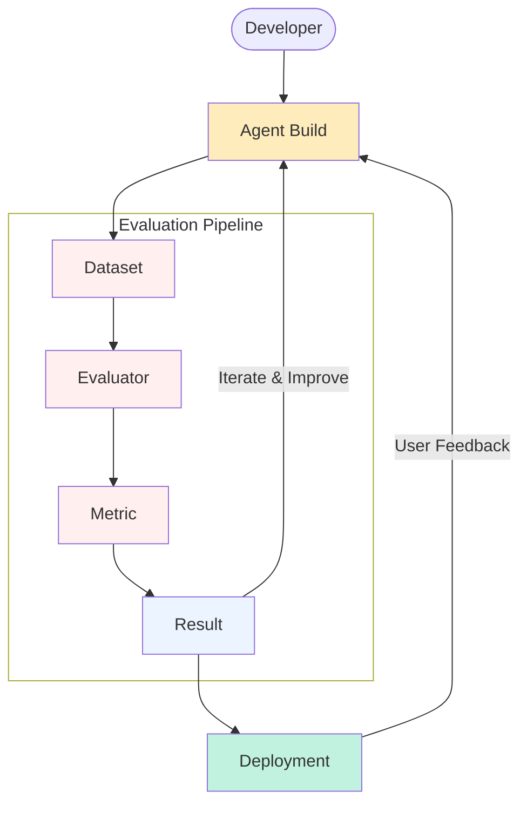

Testing has been an essential part of the software engineering lifecycle. While "Agents" are still software products, due to being stochastic in nature, they require to also be evaluated from certain other paradigms. Evaluation of AI Agents is an active area of research with currently no widespread agreed upon standards. In **Railtracks** we follow the philosophy of continuing to allow flexibility for users to define what "Evaluation of Agents" means to them.

We have set the structural outline below of two potential avenues for evaluations:

1. Evaluations that require an agent to be invoked

2. Evaluations that analyze the past results of an agent

While this results in a nice seperation between potential cases, there are some cases that have elements of both which we will expand on further in the specific sections regarding usage.

## Evaluation Flow

