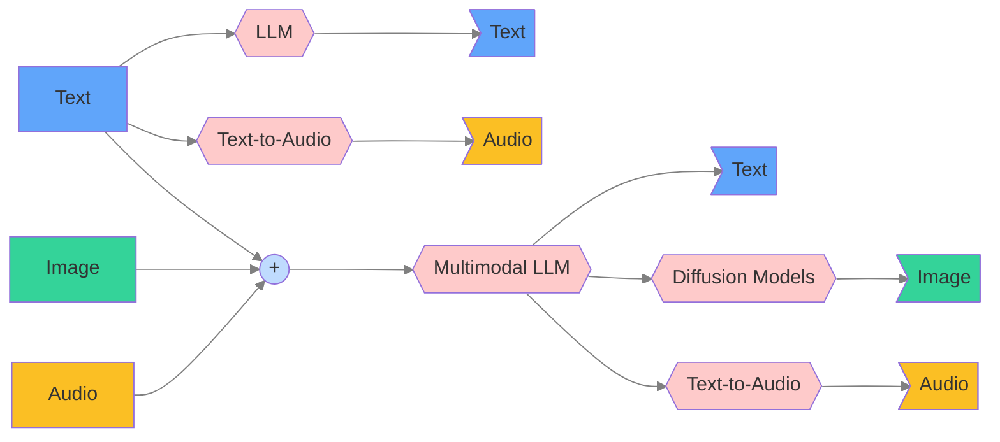

## Multimodal overview

Traditionally, LLMs map text input to text output. Newer multimodal foundation models (e.g., the GPT‑4o+ family, Claude 3.x/4.x, Gemini 1.5+) can accept additional modalities such as images and, in some cases, audio.

There are also many scenarios where you generate non‑text outputs from text prompts (images or speech) using diffusion models, TTS, or vision‑language models (VLMs) with generation capabilities.

Typical directions include:

- Text → Text (chat, reasoning)
- Image → Text (captioning, OCR, VQA)
- Audio → Text (transcription/ASR)
- Text → Image (image generation/editing)
- Text → Audio (speech synthesis/TTS)
- Image → Image (editing, inpainting, upscaling)
- Audio → Audio (voice conversion)
- Text + Image/Audio → Text/Image/Audio (multimodal reasoning and guided generation)

Below is an illustration of the input/output permutations across the three common modalities. Solid arrows represent common flows; dotted arrows indicate less common ones. The “Fusion” node illustrates multi‑input cases. As you can see things can get complicated quickly and covering all areas would require extra parameter requirements to the public API.

