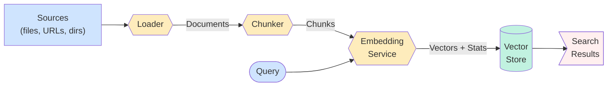
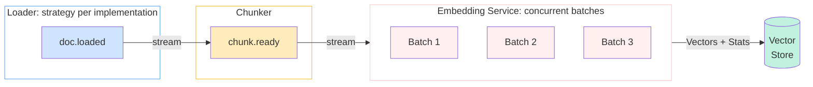

# RAG Design

Railtracks RAG is built around a clean four-stage pipeline: **load → chunk → embed → store**. Each stage is a discrete, swappable component backed by an abstract base class. The design prioritises async-first embedding, cost transparency, and a single unified module.
## Pipeline Overview



## Concurrency Model

The pipeline is **async streaming** under the hood. Rather than loading all documents into memory before chunking, each stage yields results as they are ready — `RAGPipeline.aindex()` consumes `loader.astream()`, pipes each document into the chunker, and feeds each chunk into the embedder. No stage waits for the previous one to fully drain, and the full corpus is never held in memory at once.

Each stage is an async generator that subscribes to the previous stage's output and yields into the next.

| Pub/Sub topic | Streaming equivalent |
|---|---|
| `doc.loaded` | `loader.astream()` |
| `chunk.ready` | `chunker.astream(loader.astream())` |
| `chunk.embedded` | `embedder.astream(chunker.astream(...))` |

Concurrency is applied selectively based on where the real cost lives:

| Stage | Strategy | Reason |
|---|---|---|
| Load | Loader-controlled | Simple file I/O is sequential; loaders backed by cloud OCR (e.g. Textract) implement their own concurrency in `astream()` |
| Chunk | Sequential | CPU-bound, no I/O — never the bottleneck relative to OCR or embedding |
| **Embed** | **Concurrent batches** | Network-bound, rate-limited API, 100k+ chunks at scale |
| Store | Sequential | DB handles its own concurrency |

`LiteLLMEmbeddingService` dispatches multiple batches in parallel by default, controlled by `max_concurrent_batches` to stay within API rate limits.



## Components

### Loaders
`BaseDocumentLoader` defines three methods: `astream() → AsyncGenerator[Document, None]` (the abstract primitive that subclasses must implement), `aload() → list[Document]` (collects `astream()` into a list), and `load()` (synchronous wrapper around `aload()`). `RAGPipeline` always consumes `astream()` so documents flow into the chunker as they become ready rather than waiting for the full corpus to load.

Built-in loaders:

| Loader | Source | Dep |
|---|---|---|
| `TextLoader` | `.txt`, `.md` | stdlib |
| `CSVLoader` | `.csv` (rows as Documents) | stdlib |
| `JSONLoader` | `.json` (objects as Documents) | stdlib |
| `PyPDFLoader` | `.pdf` | `railtracks[pdf]` |
| `HTMLLoader` | files or URLs | `railtracks[html]` |
| `CodeLoader` | source files (auto-detects language) | stdlib |

### Chunkers
`BaseChunker` exposes `chunk(doc) → list[Chunk]` and `chunk_many(docs) → list[Chunk]`. Each `Chunk` carries a `document_id` for full lineage back to the source `Document`. Three strategies ship out of the box: `FixedCharChunker`, `FixedTokenChunker`, and `RecursiveChunker`.

### Embedding Service
`BaseEmbeddingService` requires both `embed()` and `aembed()`. Every response is an `EmbeddingResponse` containing the vectors **and** an `EmbeddingStats` object with model name, token count, cost, and latency — cost tracking is not optional.

The default implementation, `LiteLLMEmbeddingService`, handles batching automatically and reads cost from litellm's `_hidden_params["response_cost"]`.

### Vector Stores
`AbstractVectorStore` defines a uniform interface (`add`, `search`, `delete`, `count`, `persist`, `load`) across all backends. The filter DSL (`F["field"] == value`) is evaluated in Python for the in-memory store and translated to native query syntax for external backends.

| Store | Dep |
|---|---|
| `InMemoryVectorStore` | stdlib |
| `ChromaVectorStore` | `railtracks[chroma]` |
| `PineconeVectorStore` | `railtracks[pinecone]` |
| `WeaviateVectorStore` | `railtracks[weaviate]` |

## RAGPipeline

`RAGPipeline` wires all four stages together. Stages are all optional with sensible defaults:

```python
pipeline = RAGPipeline(
    loader=PyPDFLoader("docs/"),
    chunker=RecursiveChunker(chunk_size=512),
    embedding_service=LiteLLMEmbeddingService("text-embedding-3-small"),
    vector_store=InMemoryVectorStore(),
)

stats: IndexingStats = await pipeline.aindex()
results: SearchResult = await pipeline.aquery("What is the return policy?", top_k=5)
```

`IndexingStats` reports documents indexed, chunks created, and the full `EmbeddingStats` from the run. `RAGPipeline` also exposes `as_node()` to wrap the query path as an `rt.function_node`, making it directly usable as a tool inside any agent.

## Data Model

All data models live in `rag/models.py` and are registered with `RTJSONEncoder` for serialisation.

```
Document ──► Chunk ──► VectorRecord ──► SearchEntry
  (source)   (doc_id)   (chunk_id)        (score)
```
