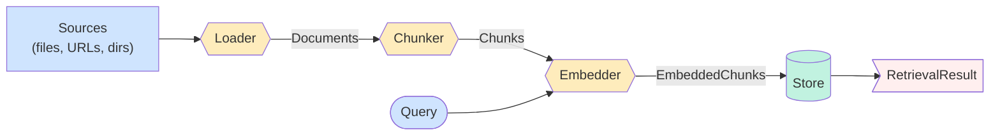
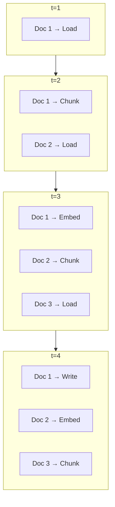

# Retrieval Module Design

`railtracks.retrieval` is structured around a four-stage pipeline — **load →
chunk → embed → store** — orchestrated by `RetrievalRuntime`. Each stage is a
discrete, swappable component behind a small interface; the runtime owns the
wiring.

## Pipeline overview



## Streaming, not batched

`RetrievalRuntime` does **not** wait for the loader to finish before chunking,
or for chunking to finish before embedding. Each stage is async and yields
documents/chunks/batches one at a time:



Each yielded `BatchIngested` event reaches the consumer as soon as the batch
finishes writing, so callers can surface progress without buffering the
corpus.

## Module layout

```
railtracks/retrieval/
├── runtime.py          # RetrievalRuntime + IngestionEvents
├── errors.py           # EmbeddingModelMismatchError
├── models.py           # Document, Chunk, EmbeddedChunk, RetrievedChunk, RetrievalResult
├── loaders/            # BaseDocumentLoader + Text/CSV/JSON/PDF/HF loaders + SanitizingLoader
├── chunking/           # Chunker ABC, FixedToken / Sentence / Recursive / Markdown / Semantic chunkers, Tokenizer
├── embedding/          # Embedding ABC, EmbeddingResult/Failure, LiteLLM-backed providers
└── stores/             # Store protocol + StoreEntry/StoreQuery/StoreScope models
    └── vector/         # VectorStore (Store-implementing) + InMemory/Chroma/Pgvector backends
```

## Stage contracts

### Loaders

`BaseDocumentLoader.astream() → AsyncGenerator[Document, None]` is the single
abstract primitive. `aload()` and `load()` are derived from it. Subclasses
must not buffer the corpus; documents are yielded as soon as they are
available.

Wrap any loader in `SanitizingLoader(inner, sanitizer)` to redact PII or
normalize content before it reaches the embedder.

### Chunkers

`Chunker.chunk(document) → list[Chunk]` is the sync split primitive;
`achunk` and `astream_documents` are derived. Subclasses delegate to a
shared `_make_chunks` helper that enforces cross-chunker invariants
(dense 0-based `index`, `document_id` propagation, metadata copy).

### Embedders

`Embedding.aembed(list[str]) → TextEmbeddings` returns vectors plus
`EmbeddingMetrics` (model, token count, latency, cost). `astream_batches`
batches a chunk stream into fixed-size groups, yielding
`EmbeddingResult | EmbeddingFailure` per batch — the stream continues past
individual batch failures.

### Stores

The `Store` protocol exposes six async methods:

```python
class Store(Protocol):
    async def write(self, entry: StoreEntry) -> str: ...
    async def read(self, query: StoreQuery) -> list[RetrievedStoreEntry]: ...
    async def delete(self, id: UUID) -> None: ...
    async def clear(self, scope: StoreScope) -> None: ...
    async def delete_where(self, filters: dict[str, Any]) -> None: ...
    async def find(self, filters: dict[str, Any], limit: int = 1) -> list[StoreEntry]: ...
```

`VectorStore` is the canonical implementation. It delegates index operations
to a `VectorBackend` (InMemory, Chroma, or Pgvector) and owns payload
serialization, scope filtering, and `DetailLevel` projection. The backend
protocol is small enough that adding a new one is a single-file change.

## Data flow through StoreEntry

```
Document ──► Chunk ──► EmbeddedChunk ──► StoreEntry ──► RetrievedStoreEntry
 (source)  (doc_id)    (vector + model)    (payload)         (score, rank)
```

The runtime always converts back to `RetrievedChunk` (a thin shape around
`Chunk`) so the user-facing `RetrievalResult` doesn't expose store-internal
fields like `scope` or `embedding_version`.

## Upsert and staleness

Two protocol additions make ingestion safe to re-run:

- **`delete_where`** lets the runtime clear prior chunks for a document
  before writing new ones, giving upsert semantics. The delete fires
  *after* the first successful batch, so a total embedding failure leaves
  the prior version intact.
- **`find`** is a metadata-only lookup (no vector search). The runtime
  uses it to check whether a document with the same `source_path` and
  `content_hash` already exists, and short-circuits with `DocumentSkipped`
  if so. This makes re-running `ingest()` idempotent.

## Embedding-model guard

Mixing vectors from different embedding models produces meaningless
similarity scores. The runtime captures the embedder's model name on the
first successful batch and raises `EmbeddingModelMismatchError` at retrieve
time if the embedder later reports a different model. This is in-process
only — cross-process consistency (different agent restart, same store) is
out of scope today.

## Multi-tenancy

`StoreScope(user_id, agent_id, session_id, run_id)` is a hard-filter
namespace. Any non-`None` field becomes a mandatory equality filter on
every write and every read. Pass it once to `RetrievalRuntime(scope=...)`
and it threads through unconditionally; per-call overrides are supported
via `runtime.retrieve(scope=...)`.

## What's not in scope (yet)

- **Boolean filter DSL.** Filters are flat `dict[str, Any]` equality. If
  you need `OR` / `is_in`, post-filter in Python or open an issue.
- **Cross-process embedding-model guard.** The current check is in-memory.
  Promoting it to a `Store`-side property is a future addition.
- **Hybrid search (BM25 + vector).** Today's `Store` protocol is dense-only.
- **Reranker stage.** Add one yourself in user code; a built-in
  `Reranker` protocol is on the roadmap.
