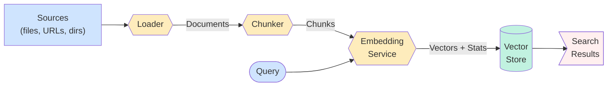
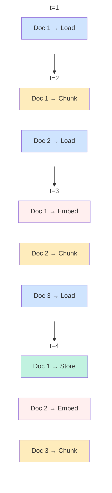

# RAG Design

Railtracks RAG is built around a clean four-stage pipeline: **load → chunk → embed → store**. Each stage is a discrete, swappable component backed by an abstract base class. The design prioritises async-first embedding, cost transparency, and a single unified module (`railtracks.rag`) rather than the previous split between `railtracks.rag` and `railtracks.vector_stores`.

## Pipeline Overview



## Parallel Ingestion

While the logical order is load → chunk → embed → store, these stages don't need to complete as a batch before the next begins. Documents move through the pipeline concurrently — document `N+1` can be loading while document `N` is being chunked, and so on. This keeps memory pressure low and makes large corpus ingestion significantly faster.



## Components

### Loaders
`BaseDocumentLoader` defines three methods: `astream() → AsyncGenerator[Document, None]` (the abstract primitive), `aload() → list[Document]` (collects `astream()` into a list), and `load()` (synchronous wrapper around `aload()`). `astream()` is the only method subclasses must implement. Built-in loaders:

| Loader | Source | Dep |
|---|---|---|
| `TextLoader` | `.txt`, `.md` | stdlib |
| `CSVLoader` | `.csv` (rows as Documents) | stdlib |
| `JSONLoader` | `.json` (objects as Documents) | stdlib |
| `PyPDFLoader` | `.pdf` | `railtracks[pdf]` |
| `HTMLLoader` | files or URLs | `railtracks[html]` |
| `CodeLoader` | source files (auto-detects language) | stdlib |

### Chunkers
`BaseChunker` exposes `chunk(doc) → list[Chunk]` and `chunk_many(docs) → list[Chunk]`. Each `Chunk` carries a `document_id` for full lineage back to the source `Document`. Three strategies ship out of the box: `FixedCharChunker`, `FixedTokenChunker`, and `RecursiveChunker`.

### Embedding Service
`BaseEmbeddingService` requires both `embed()` and `aembed()`. Every response is an `EmbeddingResponse` containing the vectors **and** an `EmbeddingStats` object with model name, token count, cost, and latency — cost tracking is not optional.

The default implementation, `LiteLLMEmbeddingService`, handles batching automatically and reads cost from litellm's `_hidden_params["response_cost"]`.

### Vector Stores
`AbstractVectorStore` defines a uniform interface (`add`, `search`, `delete`, `count`, `persist`, `load`) across all backends. The filter DSL (`F["field"] == value`) is evaluated in Python for the in-memory store and translated to native query syntax for external backends.

| Store | Dep |
|---|---|
| `InMemoryVectorStore` | stdlib |
| `ChromaVectorStore` | `railtracks[chroma]` |
| `PineconeVectorStore` | `railtracks[pinecone]` |
| `WeaviateVectorStore` | `railtracks[weaviate]` |

## RAGPipeline

`RAGPipeline` wires all four stages together. Stages are all optional with sensible defaults:

```python
pipeline = RAGPipeline(
    loader=PyPDFLoader("docs/"),
    chunker=RecursiveChunker(chunk_size=512),
    embedding_service=LiteLLMEmbeddingService("text-embedding-3-small"),
    vector_store=InMemoryVectorStore(),
)

stats: IndexingStats = await pipeline.aindex()
results: SearchResult = await pipeline.aquery("What is the return policy?", top_k=5)
```

`IndexingStats` reports documents indexed, chunks created, and the full `EmbeddingStats` from the run. `RAGPipeline` also exposes `as_node()` to wrap the query path as an `rt.function_node`, making it directly usable as a tool inside any agent.

## Data Model

All data models live in `rag/models.py` and are registered with `RTJSONEncoder` for serialisation.

```
Document ──► Chunk ──► VectorRecord ──► SearchEntry
  (source)   (doc_id)   (chunk_id)        (score)
```
