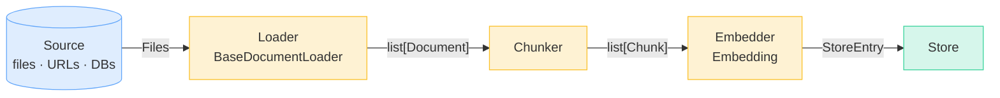
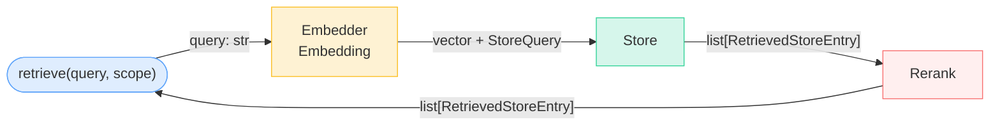
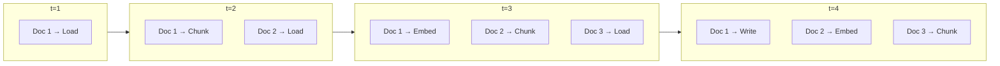

# Design

This page documents the low-level details of the internals of `railtracks.retrieval` including
stage contracts, streaming async model, the `Store` protocol, and the invariants enforced. Read this
if you are customizing a stage, adding a backend, or debugging cross-stage behaviour.

For task-oriented entry points (how to ingest, how to retrieve, how to
attach to an agent) see [Quickstart](../runtime/quickstart.md),
[Ingestion](../runtime/ingestion.md), and [Retrieval](../runtime/retrieval.md).

---

## The Two Paths

`RetrievalRuntime` is a convenient orchestrator over four submodules. Each arrow below
is a concrete data type; each node names the abstract interface, not its
implementation. The same `Embedding` and `Store` are reused across the
write and read paths.

### Ingestion (write path)



`runtime.ingest(loader)` is an async generator. Failures don't raise; they
surface as `EmbeddingFailure` / `DocumentFailed` events so a million-chunk
re-index doesn't abort on one batch. Re-running on unchanged content
short-circuits to `DocumentSkipped` via a `find()` on `source +
content_hash` before any embedding happens.

### Retrieval (read path)



The `Store` owns scope filtering, payload projection, and the conversion
back to a user-facing `RetrievedStoreEntry` and the `VectorBackend` only
sees vectors, IDs, and a flat metadata filter dict. That split is what
makes adding a backend a single-file change.

### Reading off both diagrams

- **Abstraction over implementation** The runtime depends on
  `BaseDocumentLoader` / `Chunker` / `Embedding` / `Store` instead of
  concrete implementations allowing easy swapping of components to fit unique needs
- **The `Store` protocol owns its backend.** `VectorStore` is the canonical
  `Store`; it delegates index operations to a `VectorBackend` and handles payload
  serialization, scope filtering, and projection itself.
- **Same `Embedding` on both paths.** The model used to embed documents at
  ingest time must match the model used to embed queries at retrieve time
  to ensure accurate retrieval. This invariant is enforced by the embedding-model guard (below).

Each stage is also usable independently; you can call `Chunker.achunk()`
or `Store.read()` directly when the runtime's pipelining does not fit your needs.

| Submodule | Role |
|---|---|
| `railtracks.retrieval.loaders` | Source → `Document` |
| `railtracks.retrieval.chunking` | `Document` → `Chunk[]` |
| `railtracks.retrieval.embedding` | `Chunk[]` → `EmbeddedChunk[]` |
| `railtracks.retrieval.stores` | `EmbeddedChunk` ↔ `RetrievedStoreEntry[]` |

---

## Streaming, not batched

The runtime does **not** wait for the loader to finish before chunking, or
for chunking to finish before embedding. Each stage is async and yields
documents/chunks/batches one at a time:



Each `BatchIngested` event reaches the consumer as soon as its batch
finishes writing. Callers can surface progress without buffering the corpus
ensuring safe handling of memory constraints.

---

## Stage contracts

### Loaders

`BaseDocumentLoader.astream() → AsyncGenerator[Document, None]` is the
single abstract primitive. `aload()` and `load()` are derived. Subclasses
must yield documents as soon as they're available instead of buffering the
corpus and yielding at the end which breaks the streaming model.

Wrap any loader in `SanitizingLoader(inner, sanitizer)` to redact PII or
normalize content before it reaches the embedder. The sanitizer runs once
per document, so `content_hash` is computed on sanitized text and the
skip-by-hash idempotency path stays accurate.

### Chunkers

`Chunker.chunk(document) → list[Chunk]` is the sync split primitive;
`achunk` and `astream_documents` are derived. Subclasses delegate to a
shared `_make_chunks` helper that enforces cross-chunker invariants:

- Dense 0-based `Chunk.index`.
- `document_id` propagation from the source `Document`.
- Shallow metadata copy with chunker-specific overlay.
- Optional `(start, end)` offsets when the chunker knows them.

### Embedders

`Embedding.aembed(list[str]) → TextEmbeddings` returns vectors plus
`EmbeddingMetrics` (model, token count, latency, cost). `astream_batches`
batches a chunk stream into fixed-size groups and yields
`EmbeddingResult | EmbeddingFailure` per batch. **The stream continues
past individual batch failures** delegating the handling of failed batches to the users.

### Stores

The `Store` protocol exposes six async methods:

```python
class Store(Protocol):
    async def write(self, entry: StoreEntry) -> str: ...
    async def read(self, query: StoreQuery) -> list[RetrievedStoreEntry]: ...
    async def delete(self, id: UUID) -> None: ...
    async def clear(self, scope: StoreScope) -> None: ...
    async def delete_where(self, filters: dict[str, Any]) -> None: ...
    async def find(self, filters: dict[str, Any], limit: int = 1) -> list[StoreEntry]: ...
```

`VectorStore` is the canonical implementation. It delegates index
operations to a `VectorBackend` (InMemory, Chroma, or Pgvector) and owns
payload serialization and scope filtering. The backend protocol is small
enough (`upsert`, `search`, `delete`, `delete_where`) that adding a new
backend is a single-file change.

---

## Data flow

```
Document ──► Chunk ──► EmbeddedChunk ──► StoreEntry ──► RetrievedStoreEntry
 (source)   (doc_id)    (vector+model)    (payload)        (score, rank)
```

The runtime converts back to `RetrievedChunk` (a thin shape around `Chunk`)
before handing results to the caller, so the user-facing `RetrievalResult`
doesn't leak store internals like `scope` or `embedding_version`.

---

## Upsert and staleness

Two protocol additions make ingestion safe to re-run:

- **`delete_where`** lets the runtime clear prior chunks for a document
  before writing new ones. The delete fires *after* the first successful
  batch, so a total embedding failure leaves the prior version intact.
- **`find`** is a metadata-only lookup (no vector search). The runtime
  uses it to check whether a document with the same `source` and
  `content_hash` already exists, and short-circuits with `DocumentSkipped`
  if so. This is what makes `ingest()` cheaply idempotent.

Both fire automatically. The cost is one extra `find` call per document; the
benefit is that re-ingesting a folder is a no-op when nothing changed.

---

## Embedding-model guard

Mixing vectors from different embedding models produces meaningless
similarity scores. For instance, `text-embedding-3-small` and `text-embedding-3-large`
live in entirely different vector spaces. The runtime captures the
embedder's model name on the first successful batch and raises
`EmbeddingModelMismatchError` at both ingest and retrieve time if the
embedder later reports a different model.

The check is **cross-process**. On the first call after construction, the
runtime seeds itself by reading `embedding_model` off any one existing
`StoreEntry` (via `Store.find({}, limit=1)`) so a brand-new runtime
pointed at a store written by an earlier process inherits the captured
model and catches a mismatched embedder before any writes happen. On
ingest the check fires before `delete_where`, so a mismatched batch can
never corrupt the store by clearing prior chunks first.

The guard is best-effort: if your embedder doesn't report a model name
(some adapters return `None`), the check is a no-op. Empty stores have
nothing to seed from, so the first writer always wins.

---

## Multi-tenancy

`StoreScope` wraps an open `labels: Mapping[str, Any]`. Each entry is a
mandatory equality filter on every write and read. The retrieval module
doesn't know what dimensions you scope by. Common shapes:
`{"user_id": "alice"}`, `{"organization": "acme", "environment": "prod"}`,
`{"agent_id": "docs-bot", "session_id": "s1"}`. Pass it per call:
`runtime.ingest(loader, scope=...)` / `runtime.retrieve(query, scope=...)`.
Scope is request-level context, so it isn't a constructor argument and
one runtime serves any number of tenants.

The scope filter lives in `Store.read`, not the runtime meaning even direct
calls to `VectorStore.nearest_neighbors()` honor it. Two tenants can
share an `InMemoryVectorBackend` without leaking data across.

---

## On the roadmap but not currently implemented:

- **Boolean filter DSL.** Filters are flat `dict[str, Any]` equality. If
  you need `OR` / `is_in` / range, post-filter in Python or open an issue.
- **Hybrid search (BM25 + vector).** Today's `Store` protocol is dense-only.
- **Reranker stage.** Add one yourself in user code; a built-in `Reranker`
  protocol is on the roadmap.
