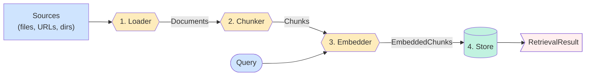

!!! warning "Beta"
    `railtracks.retrieval` is in beta. Please expect API changes between minor releases.

!!! warning "Migrated from older modules"
    `railtracks.rag` and `railtracks.vector_stores` are removed. Everything
    now lives under `railtracks.retrieval`.

    This module is in a beta and we are actively polishing the pieces.

# Quickstart

`railtracks.retrieval` is the module for everything that turns raw sources
into a searchable index and queries it back — **ingestion** (loading,
chunking, embedding) and **vector search**, with the same runtime
answering both.

`RetrievalRuntime` pipelines the four stages:



---

## Minimal pipeline

```python
--8<-- "docs/scripts/retrieval/overview_example.py:minimal"
```

Three options decide the shape of a runtime: **chunker**, **embedder**,
**store**. 
**Loader** is a parameter passed to `.ingest(...)` or `.ingest_all(...)` allowing reading of file systems with different file types.
---

## Where to go next

| You want to… | Read |
|---|---|
| Get documents into the store (streaming events, re-ingest, multi-tenant writes, sanitization, token guards) | **[Ingestion](ingestion.md)** |
| Run vector search (top-k, metadata filters, per-call scope) or attach a runtime to an agent | **[Retrieval](retrieval.md)** |
| Understand the internals, async model, and to customize things | **[Components → Design](../components/design.md)** |

---

## Key types

The following data models flow through the pipeline. Each links to the page that owns
its full description.

| Type | What it is |
|---|---|
| [`Document`](../components/ingestion/base.md#the-document-object) | One unit of source content produced by a loader. |
| [`Chunk`](../components/chunking/base.md#the-chunk-object) | A slice of a Document produced by a chunker carrying `document_id` and metadata. |
| [`EmbeddedChunk`](../components/embeddings/overview.md#the-embeddedchunk-object) | A chunk plus its embedding vector and model name. |
| [`StoreEntry`](../components/stores/base.md#data-models) | The atomic unit a store reads and writes. |
| [`RetrievalResult`](retrieval.md) | What `runtime.retrieve()` returns: ranked `RetrievedChunk`s plus the query. |
| [`StoreScope`](../components/stores/base.md#data-models) | A hard-filter namespace: a label dict (`{"user_id": "alice"}`, `{"organization": "acme"}`, etc.) enforced as equality filters on every read and write. |

---

## Stage choices

Pick the right component for each stage. Each link goes to the page that
covers the trade-offs.

| Stage | Built-in options | Picked by |
|---|---|---|
| **Load** | `TextLoader`, `CSVLoader`, `PyPDFLoader`, `PyPDFOCRLoader`, `HuggingFaceDatasetLoader`, `JSONLoader`, `LangChainLoaderAdapter` | [Ingestion overview](../components/ingestion/base.md) |
| **Chunk** | `RecursiveCharacterChunker`, `MarkdownHeaderChunker`, `SentenceChunker`, `FixedTokenChunker` | [Chunking methods](../components/chunking/methods.md) |
| **Embed** | `OpenAIEmbedding`, `AzureEmbedding`, `OllamaEmbedding`, `LiteLLMEmbedding` | [Embeddings methods](../components/embeddings/methods.md) |
| **Store** | `VectorStore` with `InMemoryVectorBackend`, `ChromaBackend`, or `PgvectorBackend` | [Store backends](../components/stores/backends.md) |
