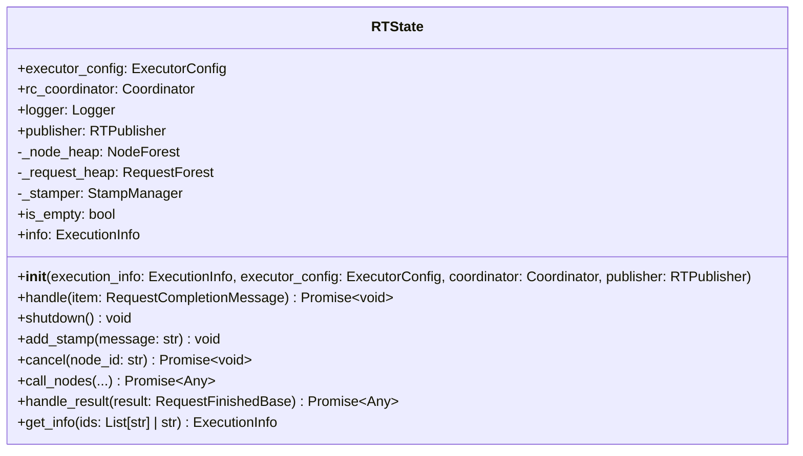
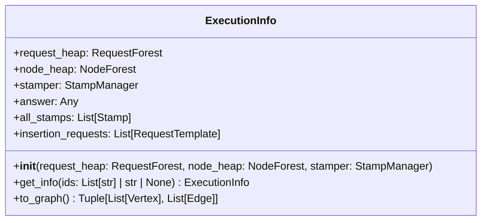
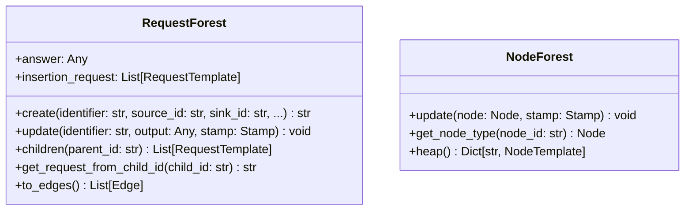
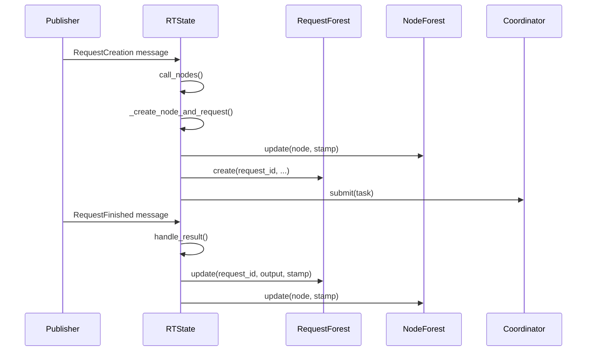
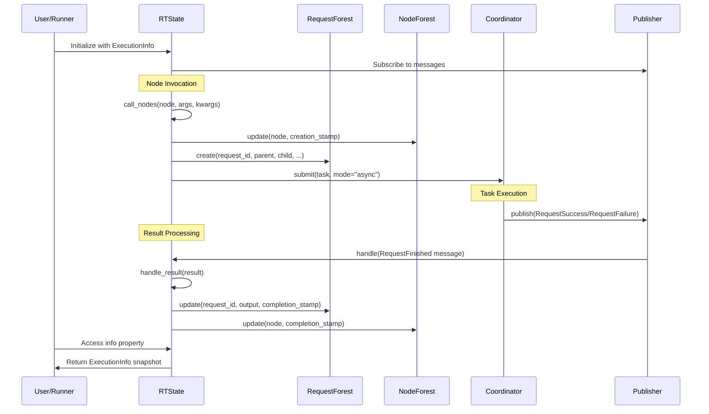
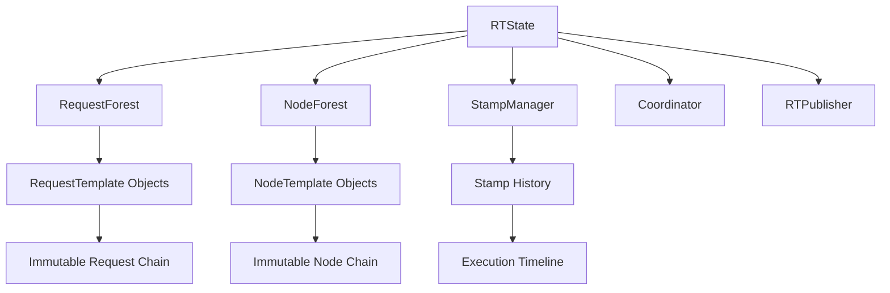

# RTState

## Overview

The `RTState` class is the central state management component of the Railtracks system, responsible for maintaining and coordinating the complete execution state during request completion workflows. It acts as the primary orchestrator that manages the lifecycle of nodes and requests, handles message processing from the pub/sub system, and maintains comprehensive execution history through forest-based data structures.

## Key Components

### `RTState`

The main state management class that orchestrates the entire execution environment. It maintains execution state through specialized forest data structures, coordinates with the `Coordinator` for task execution, handles pub/sub message processing, and provides comprehensive logging and error handling throughout the system lifecycle.



### `ExecutionInfo`

A snapshot container that encapsulates the complete state of the system at any given point in time. It provides access to the node heap, request heap, and stamping system, enabling state introspection and analysis.



### `RequestForest` and `NodeForest`

Specialized forest data structures that maintain immutable history of requests and nodes respectively. These forests enable time-travel debugging, state snapshots, and comprehensive tracking of the execution graph evolution.



## State Management Architecture

The RTState employs a sophisticated state management architecture built on immutable forest data structures:

### Forest-Based State Storage

- **Immutable History**: Each update creates a new immutable object linked to its predecessor, preserving complete execution history
- **Time-Travel Debugging**: Access any previous state through the linked object chain
- **Thread-Safe Operations**: All state modifications are protected by locks ensuring consistency in concurrent environments

### Request Lifecycle Management

1. **Request Creation**: New requests are created with unique identifiers linking parent and child nodes
2. **State Tracking**: Each request maintains its status (pending, completed, failed, cancelled) with timestamps
3. **Output Capture**: Results are captured and linked to the appropriate request for later retrieval
4. **Error Handling**: Failures are tracked with detailed exception information and context

## Core Workflows

### Node Invocation Flow

The process of invoking a node follows a well-defined sequence ensuring proper state management and error handling:

1. **Node Creation**: `_create_node_and_request` creates the node instance and establishes parent-child relationships
2. **Request Registration**: The request is registered in the `RequestForest` with initial state
3. **Task Submission**: The coordinator receives the task for execution
4. **Result Handling**: Completion messages are processed through `handle_result`
5. **State Updates**: Both node and request forests are updated with final results and timestamps

### Message Processing Pipeline

RTState subscribes to the pub/sub system and processes various message types:



### Error Handling Strategy

RTState implements a comprehensive error handling strategy:

- **Categorized Errors**: Different error types (fatal, recoverable, cancellation) are handled appropriately
- **Error Propagation**: Errors bubble up through the request chain while maintaining state consistency
- **Logging Integration**: All errors are logged with contextual information for debugging
- **System Protection**: Fatal errors can trigger system shutdown to prevent corruption

## State Introspection

### Information Access

The `info` property provides access to the current `ExecutionInfo` snapshot, enabling:

- **State Analysis**: Examine the current state of all nodes and requests
- **Progress Tracking**: Monitor completion status and identify bottlenecks
- **Debugging Support**: Access detailed execution history and error traces

### Filtered State Views

The `get_info` method allows creation of filtered state views:

```python
# Get state for specific node IDs
filtered_state = rt_state.get_info(["node_1", "node_2"])

# Get complete current state
full_state = rt_state.info
```

## Integration Points

### Coordinator Integration

RTState works closely with the `Coordinator` for task execution:

- **Task Delegation**: Submits tasks to the coordinator for execution
- **Result Processing**: Receives and processes completion notifications
- **Resource Management**: Coordinates shutdown and cleanup operations

### Publisher Integration

RTState integrates with the pub/sub system:

- **Message Subscription**: Subscribes to `RequestCompletionMessage` events
- **Event Publishing**: Publishes failure and completion events as needed
- **Asynchronous Communication**: Maintains loose coupling through message-based communication

## Diagrams

### Complete State Management Flow



### State Architecture Overview

