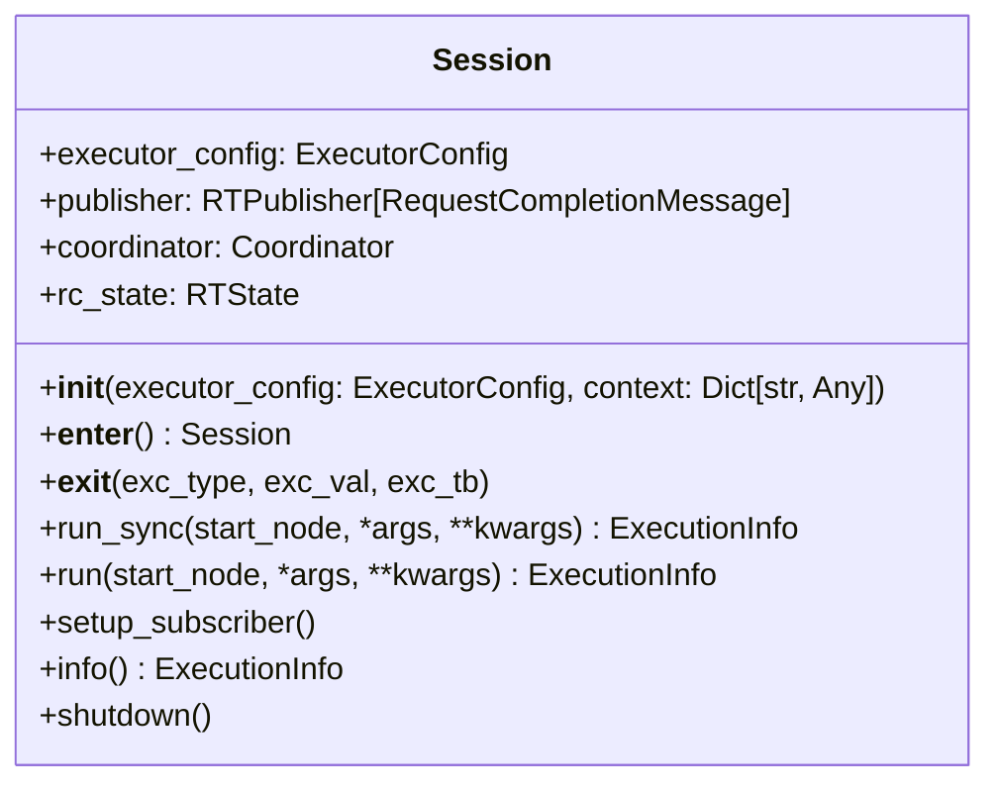
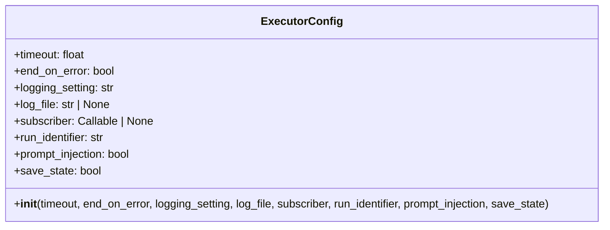
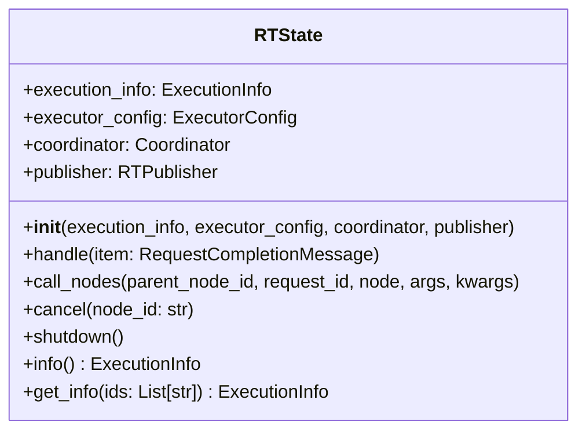
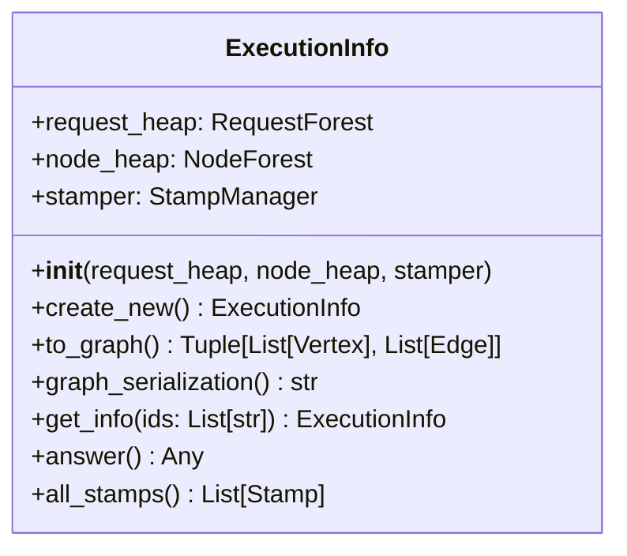
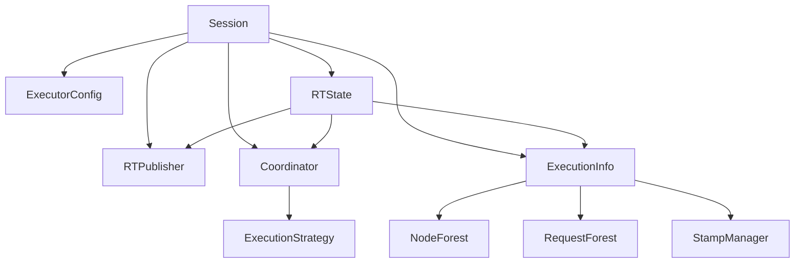
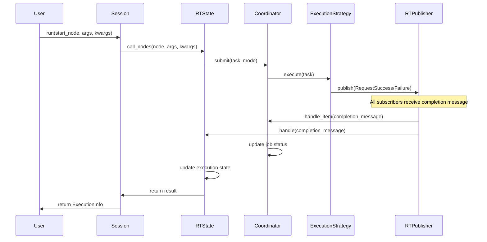

# Session

## Overview

The `Session` is the primary entry point and orchestrator for the entire Railtracks system. It serves as the main execution context that initializes, configures, and manages all core components required for running node-based workflows. The `Session` acts as a facade that brings together the `Coordinator`, `RTState`, pub/sub messaging, logging, and global context management into a unified, easy-to-use interface.

## Key Components

### `Session`

The main orchestrator class responsible for system initialization, lifecycle management, and providing both synchronous and asynchronous execution interfaces. It encapsulates all system components and manages their interactions through a well-defined lifecycle.



### `ExecutorConfig`

A configuration object that defines how the `Session` operates, including timeout settings, error handling behavior, logging configuration, and execution options. It provides comprehensive customization of the execution environment.



### `RTState`

The central state management component that tracks execution progress, manages node lifecycles, handles exceptions, and coordinates between different system components. It maintains the complete execution history and current system state.



### `ExecutionInfo`

A comprehensive data structure that captures the complete state of a run, including all nodes, requests, execution paths, timing information, and results. It provides both runtime access and post-execution analysis capabilities.



## Session Lifecycle

The `Session` follows a well-defined lifecycle that ensures proper initialization, execution, and cleanup:

### 1. Initialization Phase
```python
with rt.Session() as session:
    # Session is fully initialized and ready
```

During initialization, the `Session`:
- Creates or uses provided `ExecutorConfig`
- Initializes logging system based on configuration
- Creates `RTPublisher` for pub/sub messaging
- Instantiates `ExecutionInfo` for state tracking
- Creates `Coordinator` with execution strategies
- Initializes `RTState` to manage execution
- Registers global context variables
- Sets up subscriber connections

### 2. Execution Phase
```python
# Synchronous execution
result = session.run_sync(MyNode, arg1, arg2)

# Asynchronous execution  
result = await session.run(MyNode, arg1, arg2)
```

During execution, the `Session`:
- Delegates node execution to the global `call` function
- Maintains execution state through `RTState`
- Coordinates task execution via `Coordinator`
- Publishes and handles completion messages
- Tracks all execution details in `ExecutionInfo`

### 3. Cleanup Phase
```python
# Automatic cleanup when exiting context manager
```

During cleanup, the `Session`:
- Optionally saves execution state to disk (if `save_state=True`)
- Shuts down all execution strategies
- Detaches logging handlers
- Cleans up global context variables
- Releases system resources

## Integration with Core Components

The `Session` acts as the integration point for all major system components:



### Publisher/Subscriber Integration
The `Session` establishes a pub/sub messaging system where:
- `Coordinator` subscribes to handle task completion messages
- `RTState` subscribes to manage state updates
- Optional user subscribers can be attached for streaming

### Global Context Management
The `Session` manages global context through:
- Registration of session ID, publisher, and configuration
- Context variable scoping for nested executions
- Cleanup to prevent context leakage between runs

## Execution Flow

The complete execution flow when running a node through the `Session`:



## Configuration and Customization

The `Session` supports extensive customization through `ExecutorConfig`:

- **Timeout Control**: Set maximum execution time limits
- **Error Handling**: Configure whether to stop on first error or continue
- **Logging**: Control log levels and output destinations  
- **State Persistence**: Enable/disable saving execution state to disk
- **Streaming**: Attach custom subscribers for real-time monitoring
- **Context Injection**: Control global context variable behavior

## State Management and Introspection

The `Session` provides comprehensive state access:

```python
# Access current execution state
info = session.info

# Get filtered state for specific nodes
subset_info = info.get_info(['node_id_1', 'node_id_2'])

# Export state for analysis
graph_json = info.graph_serialization()
```

## Error Handling and Recovery

The `Session` implements robust error handling:
- **Graceful Degradation**: Continues execution when possible
- **Error Propagation**: Properly bubbles up fatal errors
- **State Preservation**: Maintains execution state even during failures
- **Cleanup Guarantees**: Ensures proper resource cleanup in all scenarios

## Usage Patterns

### Basic Usage
```python
import railtracks as rt

# Simple synchronous execution
with rt.Session() as session:
    result = session.run_sync(MyNode, input_data)
    print(result.answer)
```

### Advanced Configuration
```python
config = rt.ExecutorConfig(
    timeout=300,
    end_on_error=False,
    logging_setting="DEBUG",
    save_state=True,
    subscriber=my_streaming_handler
)

with rt.Session(config) as session:
    result = await session.run(ComplexWorkflow, params)
```

### State Analysis
```python
with rt.Session() as session:
    result = session.run_sync(AnalysisNode, data)
    
    # Examine execution details
    print(f"Total nodes executed: {len(result.all_stamps)}")
    print(f"Final answer: {result.answer}")
    
    # Export for external analysis
    with open("execution_graph.json", "w") as f:
        f.write(result.graph_serialization())
```