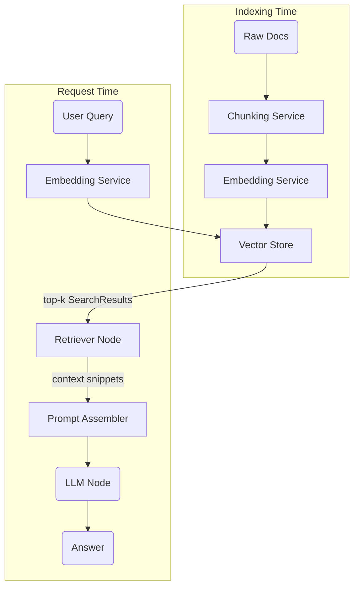

<!-- Retrieval-Augmented Generation Feature Documentation -->

# Retrieval-Augmented Generation (RAG)

RAG, or Retrieval-Augmented Generation, adds first-class “grounded answering” capabilities to agents by allowing them to search and retrieve relevant information.

RAG ingests arbitrary documents, converts them into vector embeddings, stores the vectors, and injects the most relevant context snippets into downstream Large-Language-Model (LLM) prompts so that generated answers are both up-to-date and verifiable.

**Version:** 0.0.1

## Table of Contents

- [1. Functional Overview](#1-functional-overview)
- [2. External Contracts](#2-external-contracts)
- [3. Design and Architecture](#3-design-and-architecture)
- [4. Related Files](#4-related-files)
- [CHANGELOG](#changelog)

---

## 1. Functional Overview

The feature is organised around two task sets:

1. **Indexing Pipeline** – transform raw documents into a searchable vector store  
2. **Retrieval-Augmented Generation** – enrich LLM requests with retrieved context and generate the final answer

### 1.1 Indexing Pipeline

Responsible for taking user-supplied corpora (strings, file paths, URLs, etc.) and building an efficient similarity index.

```python
from RAG.rag_core import RAG             # Component: [RAG Engine](../components/rag_engine.md)

paths = ["./docs/handbook.pdf", "./docs/faq.md"]
rag = RAG(
    paths, 
    input_type="path",
    chunk_config={"chunk_size": 800, "chunk_overlap": 120},
    embed_config={"model": "text-embedding-3-small"},
)
rag.embed_all()                          # → chunks, embeds & writes to vector store

print(rag.vector_store.count())          # sanity-check
```

Key points

• Chunking strategy, embedding model and store backend are all **configurable** and can be in memory or database.
• The default `InMemoryVectorStore` is perfect for notebooks and unit tests; swap for FAISS/Pinecone by passing `store_config={"type": "faiss"}` once the corresponding backend exists.

### 1.2 Retrieval-Augmented Generation

Wraps the index in a Request-Completion `Node` so that other nodes or HTTP handlers can query the corpus and fuse the results into the prompt.

```python
from RAG.rag_node import get_rag_node    # Component: [RAG Engine](../components/rag_engine.md)
from requestcompletion.llm import MessageHistory, UserMessage
from nodes.library.terminal_llm import TerminalLLM   # Feature: [LLM](../features/llm.md)

# 1. Build the retrieval node (one-off)
retriever = get_rag_node(
    ["./docs/policies/*.txt"],
    embed_model="text-embedding-3-small",
)

# 2. Compose with an LLM node inside your graph
question   = "How do we handle user data?"
references = retriever(question)                     # top-k SearchResult[]
context    = "\n\n".join(r.record.text for r in references)

llm_node = TerminalLLM(
    model_name = "gpt-4o",
    prompt     = f"""
Answer the user question using the context below.
If the answer is not contained, say "I don't know".

Context:
{context}

Question:
{question}
"""
)
answer = await llm_node.tracked_invoke()
print(answer)
```

• `SearchResult` objects carry both the snippet text **and** the similarity score; keep the top-N or threshold as desired.  
• Nothing prevents building more sophisticated prompt-assemblers (e.g. citation tagging), but the above shows the minimum working example.

---

## 3. Design and Architecture

This feature glues together several components rather than introducing new low-level code. The slow-changing design intent is documented here; implementation specifics live in linked component docs.

### 3.1 High-Level Data & Control Flow



Legend  
• `A…D` are implemented by the **RAG Engine** component.  
• `R` is the thin wrapper generated by `get_rag_node`.  
• `P` lives at feature layer—developers are free to implement bespoke assemblers; a minimal string concatenation example is shown above.  
• `M` relies on the **LLM Abstraction** component.

### 3.2 Component Boundaries & Responsibilities
...

### 3.3 Design Decisions & Trade-offs

Decision: **“Library-only” default** – no mandatory HTTP/CLI surface  
• Keeps dependency footprint minimal; embedders can expose their own API (FastAPI, gRPC, etc.) without contending with pre-baked endpoints.  

Decision: **Pluggable Vector Store**  
• Allows painless migration from RAM-only prototypes to distributed stores (e.g. Qdrant).  
• Requires that all store implementations respect `VectorRecord` immutability and expose a common metric interface.

Decision: **Eager Embedding (`embed_all`)**  
• Simpler mental model & avoids streaming complexity.  
• Large corpora (> 50k chunks) should pre-shard or execute the pipeline offline; a future “lazy embed” mode is tracked in backlog RFC-52.

Rejected alternative: **Direct integration with LangChain RAG**  
• LangChain offers out-of-the-box RAG primitives, but coupling would force its dependency tree (66+ packages). We chose a lean in-house engine for full control and simpler auditing.

### 3.4 Performance & Scalability

| Aspect | Baseline | Scaling Notes |
|--------|----------|---------------|
| Chunking | ~200k tokens/sec local | Pure Python split; use multiprocessing if bottlenecked |
| Embedding | **linear** in tokens | Parallelise across processes or vendor’s batch limit |
| Search | O(log n) for FAISS / sub-linear for Qdrant | In-RAM variant is O(n) but fast for ≤ 1e5 vectors |

---

## 4. Related Files

### 4.1 Related Component Files

- [`components/rag_engine.md`](../components/rag_engine.md) – Implements the underlying index and search logic.  
- [`components/llm_abstraction.md`](../components/llm_abstraction.md) – Supplies LLM chat/structured/streaming calls used during generation.  
- [`components/node_framework.md`](../components/node_framework.md) – Execution substrate for nodes created by `get_rag_node`.  
- [`components/logging_utilities.md`](../components/logging_utilities.md) – Structured logging for retrieval and generation phases.  
- [`components/exception_framework.md`](../components/exception_framework.md) – Validation and error classes surfaced to callers.

### 4.2 Related Feature Files

- [`features/nodes.md`](../features/nodes.md) – Authoring & orchestration of nodes.  
- [`features/llm.md`](../features/llm.md) – High-level usage patterns for the LLM feature (prompt-builder templates, tool-calling, etc.).

### 4.3 External Dependencies

- [`https://github.com/BerriAI/litellm`](https://github.com/BerriAI/litellm) – Embeddings and chat transport.  
- Vector store backends (optional):  
  - [`https://github.com/facebookresearch/faiss`](https://github.com/facebookresearch/faiss)  
  - [`https://qdrant.tech`](https://qdrant.tech)

---

## CHANGELOG

- **v0.0.1** (2024-06-06) [`<INITIAL>`]: Initial feature documentation extracted from prototype demo.