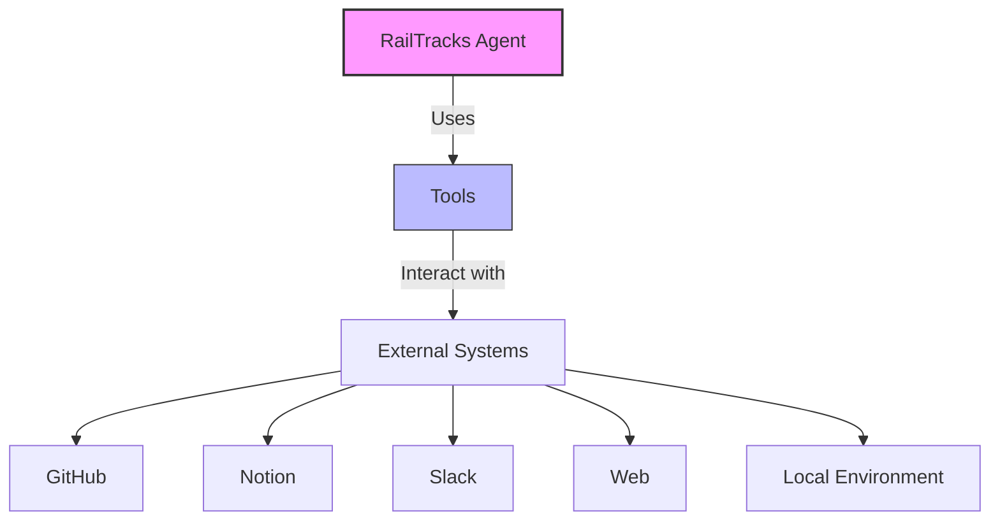

# 🛠️ RailTracks Tools

!!! tip "Extend Your Agents' Capabilities"
    Tools transform LLMs from chatbots into true agents that can take action in the world.

RailTracks provides a comprehensive suite of tools that extend the capabilities of your agents, allowing them to interact with external systems and services. These tools are the "hands and eyes" of your agents, enabling them to perform actions beyond just generating text.



## Ways to Get Tools

RailTracks offers multiple ways to access and create tools:

1. **Built-in Tools** - Use our pre-built tools for common tasks
2. **[MCP Tools](mcp/index.md)** - Connect to Model Context Protocol servers for additional capabilities
3. **[Create Your Own](create_your_own.md)** - Build custom tools for your specific needs

For a conceptual overview of tools in RailTracks, see the [Tools Guide](/guides/tools).

## Available Tools

### Built-in Tools

| Tool | Description | Use Case |
|------|-------------|----------|
| [**Python Execution**](guides/python_sandbox.md) | Write and run Python code | Data analysis, calculations, algorithmic tasks |
| [**Local Shell**](guides/shell_bash.md) | Execute commands in your local environment | File operations, system management, running scripts |

### MCP-Based Tools

| Tool | Description | Use Case |
|------|-------------|----------|
| [**GitHub**](guides/github.md) | Interact with GitHub repositories | Code management, issue tracking, PR reviews |
| [**Notion**](guides/notion.md) | Create and manage Notion pages | Knowledge management, documentation, project planning |
| [**Slack**](guides/slack.md) | Send and receive Slack messages | Team communication, notifications, updates |
| [**Web Search**](guides/websearch_integration.md) | Search the web and retrieve information | Research, fact-checking, data gathering |

## Getting Started

To use tools in your RailTracks agents, you'll typically follow these steps:

1. **Import the tools** you want to use
2. **Create an agent** that can access these tools
3. **Run the agent** with your desired input

```python
import railtracks as rt
from railtracks.nodes.library import from_mcp_server
from railtracks.rt_mcp import MCPHttpParams

# Get tools from an MCP server
server = from_mcp_server(MCPHttpParams(url="https://remote.mcpservers.org/fetch/mcp"))
tools = server.tools

# Create an agent with access to these tools
agent = rt.library.tool_call_llm(
    connected_nodes=set(tools),
    pretty_name="Research Agent",
    system_message=rt.llm.SystemMessage("Use the tools to find information."),
    model=rt.llm.OpenAILLM("gpt-4o"),
)

# Run the agent
with rt.Runner() as runner:
    result = runner.run_sync(
        agent, 
        rt.llm.MessageHistory([rt.llm.UserMessage("Find information about RailTracks")])
    )
```

## Next Steps

- Learn about [Model Context Protocol (MCP)](mcp/index.md) for accessing even more tools
- Explore how to [create your own custom tools](create_your_own.md)
- Check out the [tool-specific guides](#available-tools) for detailed usage instructions