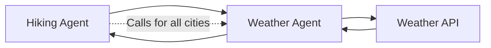
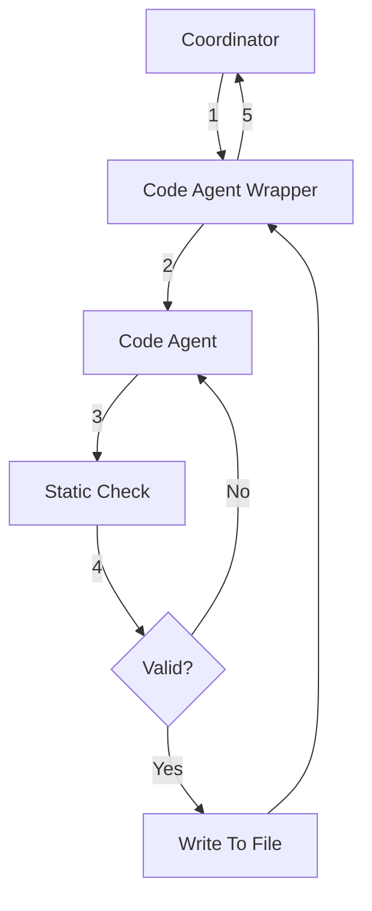
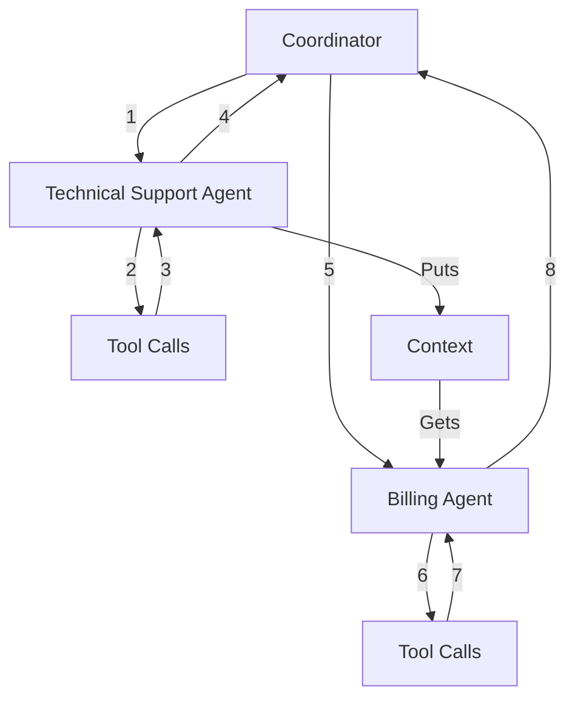

# Controlling Flows and Wrapping Nodes

RailTracks makes it easy to create custom agents with access to tools they can call to complete tasks. But what if you want to use agents themselves as tools? In this section, we’ll explore more complex flows and how RailTracks gives you control over them.

To start, let’s look at the simplest case: an agent that uses another agent as a tool.

### Example
```python
import railtracks as rt
from pydantic import BaseModel

#As before, we will create our Weather Agent with the additional tool manifest so that other agents know how to use it
class WeatherResponse(BaseModel):
    temperature: float
    condition: str

def weather_tool(city: str):
    """
    Returns the weather for a given city.

    Args:
      city (str): The name of the city to get the weather for.
    """
    # Simulate a weather API call
    return f"{city} is sunny with a temperature of 25°C."

weather_manifest = ToolManifest(
    description="A tool you can call to see what the weather in a specified city"
    parameters=Parameter("prompt", "string", "Specify the city you want to know about here") #Cross Reference this is the way to do this
)
WeatherAgent = rt.agent_node(
    name="Weather Agent",
    llm_model=rt.llm.OpenAILLM("gpt-4o"),
    system_message="You are a helpful assistant that answers weather-related questions.",
    tool_nodes=[rt.function_node(weather_tool)],
    schema=WeatherResponse,
    tool_manifest=weather_manifest
)

#Now lets create a hiking planner agent

HikingAgent = rt.agent_node(
    name="Hiking Agent",
    llm_model=rt.llm.OpenAILLM("gpt-4o"),
    system_message="You are a helpful assistant that answers questions about which cities have the best conditions for hiking. The user should specify multiple cities near them.",
    tool_nodes=[WeatherAgent],
)
```
You can see here that the flow will look like this



## Another Simple Flow but Using Context to Ensure Precise Outputs

Specialized agents perform better than generalist ones. For the simplest of coding projects, you might use a Top Level Agent for ideation and dialogue, a Coding Agent for the code itself, and a Static Checker for validation. It would be important that once the Static Checker approves code, no agents modify it further though. 

One important aspect of RailTracks is that it handles these complex flows through wrappers. All functions and flows can become nodes that you can run by wrapping them with `function_node`.

 In the following example you'll see an example of how RailTracks deals with mid-flow validation.

### Example
```python
import railtracks as rt
import ast

#Static checking function
def static_check():
    """
    Checks the syntax validity of Python code stored in the variable `code`.

    Attempts to parse the code using Python's AST module. Returns a tuple indicating whether the syntax is valid and a message describing the result.

    Returns:
        tuple[bool, str]:
            - True and a success message if the syntax is valid.
            - False and an error message if a SyntaxError is encountered.
    """
    try:
        ast.parse(code)
        return True, "Syntax is valid"
    except SyntaxError as e:
        return False, f"Syntax error: {e}"
    
CodeManifest = ToolManifest(
    """This is an agent that is an python coder and can write any
     code for you if you specify what you would like.""",
    set([Parameter(
        name='prompt',
        param_type='string',
        description="""This is the prompt that you should provide that 
        tells the CodeAgent what you would like to code.""",
        )])
    )

CodingMessage = """You are a master python agent that helps users by 
providing elite python code for their requests. You will output valid python code that can be directly used without any further editing. Do not add anything other than the python code and python comments if you see fit."""

CoordinatorMessage = """You are a helpful assistant that will talk to users about the type of code they want. You have access to a CodeAgent tool to generate the code the user is looking for. Your job is to clarify with users to ensure that they have provided all details required to write the code and then effectively communicate that to the CodeAgent. Do not write any code and strictly refer to the CodeAgent for this."""

#Create our Coding Agent as usual
coding_agent = rt.agent_node(
    name="Code Tool",
    system_message=CodeMessage,
    schema=CodeResponse,
    llm_model=rt.llm.OpenAILLM("gpt-4o"),
    )

#Wrap our Validation and file writing flow in a function
def CodeAgent(title : str, prompt : str):
    valid = False
    problem = "There were no problems last time"
    while not valid:
        response = rt.call_sync(
        CodeAgent,
        user_input=prompt + " Your Problem Last Time: " + problem
        )

        valid, problem = static_check(response.text)

    with open("new_script.py", "w") as file:
        file.write(response.text)
    
    return "Success"


tool_nodes = {rt.function_node(CodeAgent, tool_manifest=CodeManifest)}

CoordinatorAgent rt.chatui_node(
    name="Coordinator",
    system_message=CoordinatorMessage,
    tool_nodes=tool_nodes,
    llm_model=rt.llm.OpenAILLM("gpt-4o"),
    )

rt.call_sync(
        CoordinatorAgent,
        user_input="Would you be able to generate me code that takes 2 numbers as input and returns the sum?"
    )
```
### What this flow would look like



!!! info "Structuring Flows"
    When possible, you should try to keep your flows linear. Notice above that it would also be possible to give the coordinator access to both the static checker as well as the coding agent. In such a simple example, likely this would have been fine but two problems arise with this approach. Firstly, this is a simple validation step that should happen every time code is generated. Leaving it up to the coordinator to call the static checker adds unnecessary complexity to the agent and creates the possibility for the the validation step to be skipped. It can sometimes be easier to think about a more flexible flow but you try to linearize your flow as much as possible. The second problem we will discuss below.


## Handling More Complex Flows
While `function_node` works well for linear flows, some scenarios require transferring between different agents like moving from technical support to billing in a customer service system.
In these cases, you need to pass data directly between agents without mutations or the "telephone game" effect of traditional handoffs. RailTracks solves this with [context](../advanced_usage/context.md), a mechanism for sharing data across agent transfers while preserving integrity.
Let's see how context enables reliable multi-agent workflows.

### Customer Service Agents
```python

import railtracks as rt

#Initialize all your system messages, schemas, and tools here.
...

QualityAssuranceAgent = rt.agent_node(
    name="Quality Assurance Agent",
    tool_nodes=QATools,
    schema=QASchema,
    system_message=QAMessage,
    llm_model=rt.llm.OpenAILLM("gpt-4o"),
    )

ProductExpertAgent = rt.agent_node(
    name="Product Expert Agent",
    tool_nodes=PETools,
    schema=PESchema,
    system_message=PEMessage,
    llm_model=rt.llm.OpenAILLM("gpt-4o"),
    )

BillingAgent = rt.agent_node(
    name="Billing Agent",
    tool_nodes=BillingTools,
    schema=BillingSchema,
    system_message=BillingMessage,
    llm_model=rt.llm.OpenAILLM("gpt-4o"),
    )
    
TechnicalAgent = rt.agent_node(
    name="Technical Support Agent",
    tool_nodes=TechnicalTools,
    schema=TechnicalSchema,
    system_message=TechnicalMessage,
    llm_model=rt.llm.OpenAILLM("gpt-4o"),
    )

def BillingTool(prompt : str):
    if has_context := rt.context.has("info_from_other_agents"):
        prompt = prompt + "Previously the User had this interaction " + rt.context.get(info_from_other_agents) 
    response = rt.call_sync(
        BillingAgent,
        user_input=prompt
        )
    if has_context:
        previous = rt.context.get("info_from_other_agents")
        new = previous.append(response.structured.info)
    else:
        new = [response.structured.info]
    rt.context.put("info_from_other_agents", new)


def TechnicalTool(prompt : str):
    if has_context := rt.context.has("info_from_other_agents"):
        prompt = prompt + "Previously the User had this interaction " + rt.context.get(info_from_other_agents) 
    response = rt.call_sync(
        TechnicalAgent,
        user_input=prompt
        )
    if has_context:
        previous = rt.context.get("info_from_other_agents")
        new = previous.append(response.structured.info)
    else:
        new = [response.structured.info]
    rt.context.put("info_from_other_agents", new)

#This would be similar to functions above
def QATool():
    ...
#This would be similar to functions above
def PETool():
    ...

tools = {rt.function_node(BillingTool), rt.function_node(TechnicalTool), rt.function_node(QATool), rt.function_node(PETool)}

Coordinator = rt.agent_node(
    name="Coordinator Agent",
    tool_nodes=tools,
    llm_model=rt.llm.OpenAILLM("gpt-4o"),
    system_message=CoordinatorMessage,
)

response = rt.call_sync(
        CoordinatorAgent,
        user_input=""
    )
```

### What an example flow would look like

